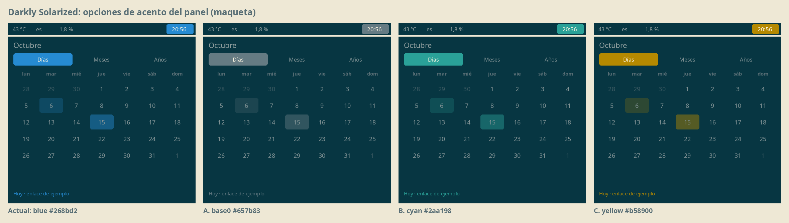
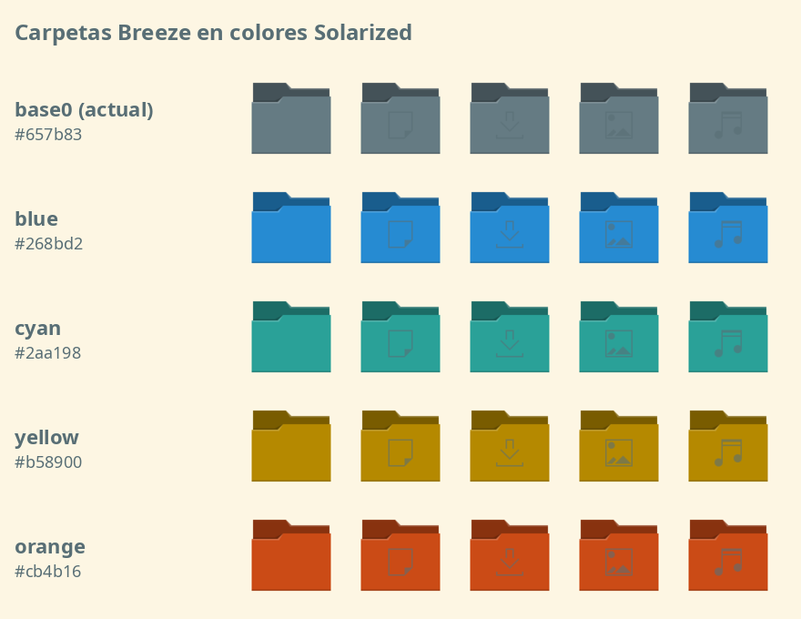

# KDE Solarized Darkly

Ventanas en **Solarized Light** y panel en **Solarized Dark** para KDE Plasma 6, conservando el diseño del Plasma Style [Darkly](https://github.com/Bali10050/Darkly): pestañas rellenas, resaltados suaves sin borde y sombreado plano. Incluye variantes de acento y de color de carpetas que se eligen desde Configuración del sistema.




*Las imágenes son maquetas con los colores reales de cada variante.*

## Qué genera

| Configuración del sistema → | Opciones |
|---|---|
| **Colores** (ventanas) | Solarized Light · Gris / Cian / Amarillo, y lo mismo en Dark |
| **Estilo de Plasma** (panel) | Darkly Solarized · Gris / Cian / Amarillo |
| **Iconos** | Breeze Solarized · Carpetas amarillo / azul / gris / según acento |

Las tres partes son independientes y se combinan libremente.

Los temas de íconos también sustituyen algunos íconos de bandeja de colores por versiones monocromas que siguen el esquema:
- **Proton VPN** (Flatpak): mantiene la palomita verde de "conectado" y la ✕ roja de "error".
- **SyncThingy**.

## Requisitos

- KDE Plasma 6 con el tema de íconos Breeze
- El Plasma Style **Darkly** instalado (en `/usr/share` o `~/.local/share`). Sin él solo se generan los esquemas y los íconos.
- Python 3

## Instalación

```bash
git clone https://github.com/Rucolastico/kde-solarized-darkly.git
cd kde-solarized-darkly
python3 generar.py
```

Todo se instala en `~/.local/share`. No se toca nada del sistema y no hace falta `sudo`.

Para aplicar la combinación recomendada desde la terminal:

```bash
plasma-apply-colorscheme SolarizedLightGris
plasma-apply-desktoptheme darkly-solarized
/usr/libexec/plasma-changeicons breeze-solarized-amarillo
```

Si el panel no se actualiza:

```bash
rm -f ~/.cache/plasma*.kcache ~/.cache/plasma_theme_* ~/.cache/icon-cache.kcache
systemctl --user restart plasma-plasmashell
```

> **Acento:** cada esquema trae su propio acento. Si en Configuración → Colores eliges un acento a mano (o "a partir del fondo de escritorio"), ese manda sobre el del esquema.

## Personalizar

Los colores están al principio de `generar.py`, en `ACENTOS` y `CARPETAS`. Agrega una entrada y vuelve a ejecutar el script. Por ejemplo, carpetas violetas:

```python
CARPETAS = {"amarillo": "#b58900", "azul": "#268bd2", "gris": "#657b83", "violeta": "#6c71c4"}
```

## Desinstalar

```bash
python3 generar.py --quitar
```

Después vuelve a aplicar otro esquema, Plasma Style y tema de íconos, por ejemplo `Darkly`, `darkly` y `breeze`.

## Cómo funciona

- **Panel oscuro con ventanas claras.** Un Plasma Style sin archivo `colors` hereda el esquema global; por eso Darkly se aclara junto con las ventanas. El generador clona Darkly y le da un `colors` fijo con la paleta Solarized Dark.
- **Acentos.** Se cambia el azul `#268bd2` de los esquemas base por el acento elegido. El texto sobre la selección se ajusta para mantener el contraste: crema sobre el gris, oscuro sobre el cian y el amarillo.
- **Carpetas.** Breeze pinta las carpetas con `ColorScheme-Accent`. Las variantes copian los íconos de `places/` con el color fijo y heredan todo lo demás de Breeze.
- **Íconos de bandeja.** Usan la clase `ColorScheme-Text` para que Plasma los recoloree. El tema necesita `FollowsColorScheme=true` en su `index.theme`; sin esa línea Plasma no recolorea ningún ícono.

## Créditos y licencias

- **Plasma Style Darkly**, de [Bali10050](https://github.com/Bali10050/Darkly), GPLv2. Se copia de tu instalación al generar; no viene en este repo.
- **Esquemas Breeze Solarized**, de [ret2src](https://github.com/ret2src/kde-plasma-solarized), Unlicense. Están en `schemes/`.
- **Íconos Breeze**, de KDE, LGPL. Se copian de tu instalación al generar.
- Paleta **Solarized**, de Ethan Schoonover.

Este repositorio se distribuye bajo **GPLv2** (ver `LICENSE`).
